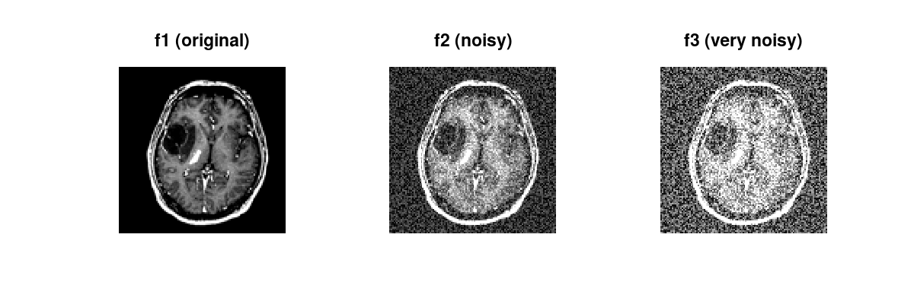
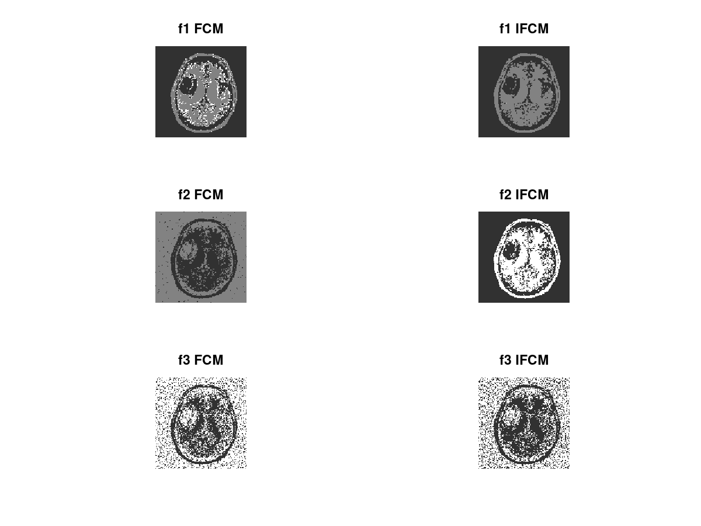

## Brain MRI Segmentation using improved fuzzy-c-means

#### ECE 417 Final Project at University of Waterloo

This program is a Matlab/Octave implementation of the ifcm algorithm
proposed in this [Research Paper by Shen et al](paper/Research-Paper-01504816.pdf).  

A comparision of segmentation using ifcm and fcm is performed on sample brain mri with varying degrees of additive noise.


### Prerequisites
------
[Image Processing Tool Box](https://www.mathworks.com/help/images/index.html).

* Include the tool box as an add-on during installation of __Matlab R2018a__.
* No action is necessary during installation of __Octave__.

### Run
------

```
git clone https://github.com/hollowmaster1496/ECE417_BrainSegmenter.git
cd ECE417_BrainSegmenter/src
```

#### Matlab

Launch Matlab by double-clicking on __main.m__. In Command window, enter:

```
main
```

#### Octave

Launch Octave by double-clicking on __main.m__. In command window, enter:

```
pkg load image
main
```

### Results
------

##### Input (Noisy Images)



##### Segmentation Output (FCM vs. IFCM)

